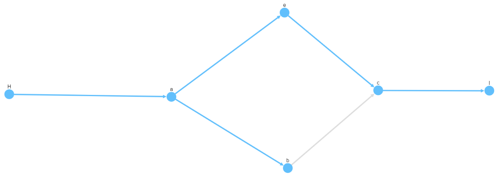

## CytoSpace - Animated BFS

# Proof of Concept - [CytoSpace](http://js.cytoscape.org/) - [Animated BFS](http://js.cytoscape.org/demos/7e2f4d29ff7ef1a1bba5/)

This POC take 6 points and link them. 
I link one point to many and many points to one.



# Add nodes

Add new element in array: nodes

# Add links

Add a new element in array: edges

```javascript
>>>>>>> Initial Commit
elements: {
      nodes: [
        { data: { id: 'a' } },
        { data: { id: 'b' } },
        { data: { id: 'c' } },
        { data: { id: 'e' } },
        { data: { id: 'H' } },
        { data: { id: 'I' } },
      ],
      edges: [
        { data: { id: 'a"e', weight: 1, source: 'a', target: 'e' } },
        { data: { id: 'ab', weight: 2, source: 'a', target: 'b' } },
        { data: { id: 'bc', weight: 3, source: 'b', target: 'c' } },
        { data: { id: 'ce', weight: 4, source: 'e', target: 'c' } },
        { data: { id: 'Ha', weight: 5, source: 'H', target: 'a' } },
        { data: { id: 'cI', weight: 6, source: 'c', target: 'I' } }
      ]
}
```
